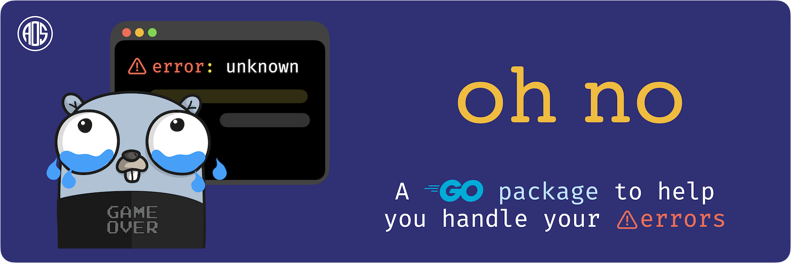

---

 This repository contains the [`ohnogen`](https://pkg.go.dev/github.com/A-0-5/ohno/cmd/ohnogen) tool and the [`ohno`](https://pkg.go.dev/github.com/A-0-5/ohno/pkg/ohno) package. If you have been manually defining error structures and handling them in the past this tool is for you. The [`ohnogen`](https://pkg.go.dev/github.com/A-0-5/ohno/cmd/ohnogen) tool takes line comment annotated enums and turns them into errors which can be passed along and used like any other error. The [`ohnogen`](https://pkg.go.dev/github.com/A-0-5/ohno/cmd/ohnogen) tool is based on the [ go stringer tool ](https://pkg.go.dev/golang.org/x/tools/cmd/stringer) . With this you can define all your error codes and their descriptions as comments and return only the enum as an error from which you can get the description and the name of the error. 

The [`ohno`](https://pkg.go.dev/github.com/A-0-5/ohno/pkg/ohno) package on the other hand will help you to add more information to an error like source location information (file, line, function) along with timestamps, custom messages, nesting and joining. This also has friendly helper methods to marshal your errors in to `json` or `yaml` formats.

You can use either [`ohnogen`](https://pkg.go.dev/github.com/A-0-5/ohno/cmd/ohnogen) tool or the [`ohno`](https://pkg.go.dev/github.com/A-0-5/ohno/pkg/ohno) package independently of each other based on your use case subject certain interface constraints being met when using the [`ohno`](https://pkg.go.dev/github.com/A-0-5/ohno/pkg/ohno) package standalone which is explained in the [`ohno`](https://pkg.go.dev/github.com/A-0-5/ohno/pkg/ohno) package documentation. You can however use the [`ohnogen`](https://pkg.go.dev/github.com/A-0-5/ohno/cmd/ohnogen) tool to generate your errors and use them without the [`ohno`](https://pkg.go.dev/github.com/A-0-5/ohno/pkg/ohno) package as long as you don't want additional context being stored in your error.

## Go References

- **[ohno](https://pkg.go.dev/github.com/A-0-5/ohno/pkg/ohno)**
- **[ohnogen](https://pkg.go.dev/github.com/A-0-5/ohno/cmd/ohnogen)**
- **[usage examples](https://pkg.go.dev/github.com/A-0-5/ohno/examples)**